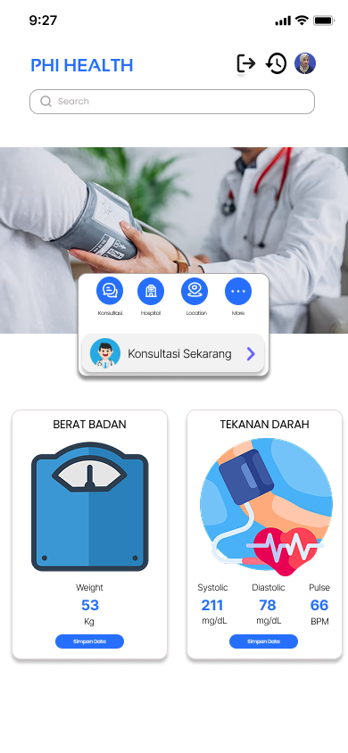

# ESP32-Based Self-Service Body Weight and Blood Pressure Measurement System with Android Application

This project is a **self-service health monitoring system** designed to measure body weight and blood pressure, using the **ESP32 microcontroller** as the main controller.  
The system integrates **hardware sensors** and an **Android application**, enabling users to independently perform health checks and view results in **real-time**.

---

## 📌 System Overview

The system consists of two main components:

- **Hardware Device**
  - ESP32 microcontroller
  - Load Cell sensor with HX711 amplifier (measuring weight up to 200 kg)
  - Pressure Sensor (MPS20N0040D / MPX2010DP)
  - LCD Display

- **Android Application**
  - Displays real-time measurement results
  - Stores health data for users
  - User-friendly monitoring dashboard

---

## 📊 Block Diagram

The block diagram illustrates the flow of **input, process, and output** in the system:

---

## 🔄 Flowchart

The measurement process follows these steps:

1. The device is powered on and performs a self-test.  
2. The system checks the network connection.  
   - If not connected, the device retries until successful.  
3. If connected, ESP32 resets data to the initial state.  
4. The user presses the **Start button** to begin measurement.  
5. The ESP32 reads data from:  
   - Load Cell sensor (weight)  
   - Pressure sensor (blood pressure)  
6. Data is processed, sent to the server, and stored in the database.  
7. Measurement results are displayed on the **LCD** and sent to the **Android application**.

---

## ⚙️ Features

- ✅ Self-service health measurement (no medical staff required)  
- ✅ Accurate weight measurement with Load Cell + HX711  
- ✅ Blood pressure measurement using MPX2010DP sensor  
- ✅ Real-time data processing with ESP32  
- ✅ Results displayed on LCD and Android application  
- ✅ Data storage in database for monitoring history  

---

## 📱 Android Application Preview

Below are 6 screenshots of the Android application:

| Open Page | Login Page | Register Page |
|-----------|------------|---------------|
|  |  |  |

| Home Page | Konsultasi Page | History Page |
|-----------|-----------------|--------------|
|  |  |  |

## 🛠️ Technology Stack

- **Hardware:** ESP32, Load Cell + HX711, MPX2010DP Pressure Sensor, LCD Display  
- **Software:** Arduino IDE (ESP32), Android Studio (Kotlin), Firebase/MySQL (database)  
- **Communication:** Wi-Fi (ESP32 → Server → Android App)  

---

